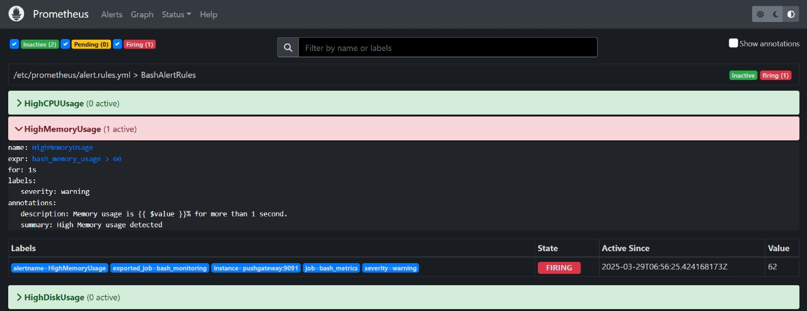
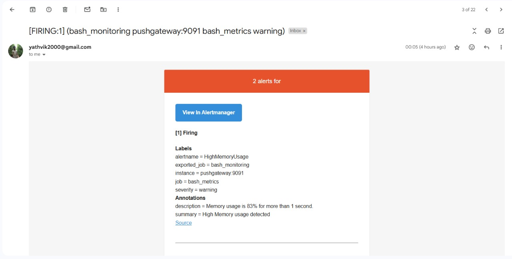
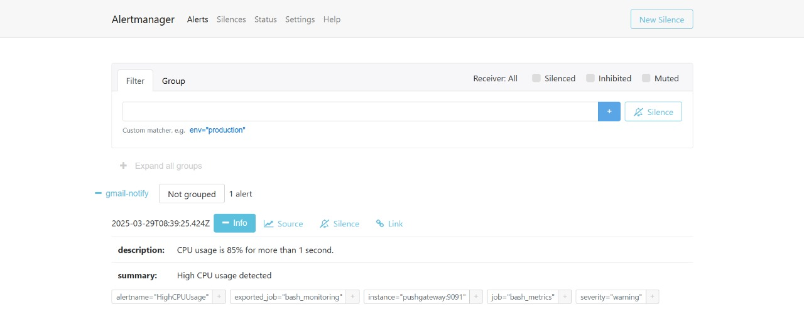
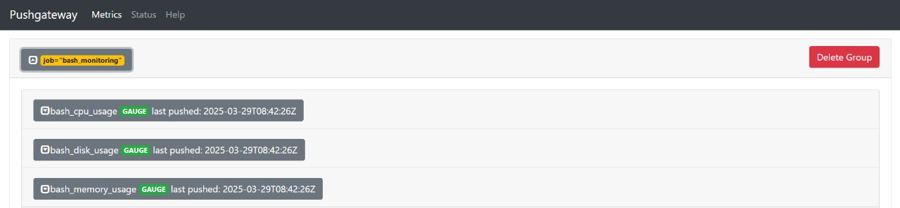
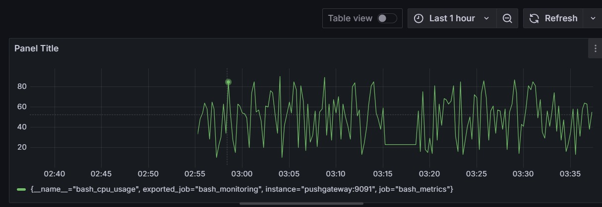

# DevOps Monitoring and Alerting System

A scalable, containerized monitoring solution built for Linq's DevOps Engineer Assessment. This project leverages **Bash**, **Prometheus**, **Alertmanager**, **Pushgateway**, and **Grafana** to demonstrate real-time metric collection, alerting, and visualization in a modular and extensible architecture.

---

## Table of Contents

- [Overview](#overview)
- [Part 1: Monitoring Design](#part-1-monitoring-design)
- [Part 2: Alerting Strategy](#part-2-alerting-strategy)
- [Part 3: Implementation & Scalability](#part-3-implementation--scalability)
- [Part 4: Visualization Dashboard](#part-4-visualization-dashboard)
- [Project Structure](#project-structure)
- [How to Run](#how-to-run)
- [Screenshots](#screenshots)
- [Submission](#submission)

---

## Overview

This project simulates a production-ready observability system using open-source tools. It demonstrates:

- Metric generation using Bash
- Data collection via Prometheus
- Alert routing with Alertmanager
- Live dashboards in Grafana
- Containerization via Docker Compose

It is designed with **scalability and modularity** in mind, enabling additional metrics or services to be integrated easily.

---

## Part 1: Monitoring Design

### Monitored Metrics

| Metric              | Source       | Description                    |
|---------------------|--------------|--------------------------------|
| `bash_cpu_usage`    | Bash script  | Simulated CPU usage (%)        |
| `bash_memory_usage` | Bash script  | Simulated Memory usage (%)     |
| `bash_disk_usage`   | Bash script  | Simulated Disk usage (%)       |

### Metric Generation

- `bash_metrics.sh`: Simulates CPU, memory, and disk usage using `shuf`
- Sends metrics to **Pushgateway** using `curl` every 10 seconds

### Metrics Collection Backend

- **Prometheus** scrapes metrics from Pushgateway every 5 seconds
- Pull-based model ensures flexibility and observability

---

## Part 2: Alerting Strategy

Alerts fire when thresholds are breached for more than 1 second (set low for testing visibility).  
These alerts are evaluated by Prometheus and routed to Alertmanager using pre-configured alert rules.

### Alert Delivery

- Alertmanager routes alerts via **Gmail SMTP**
- Uses a Gmail **App Password** for authentication
- Emails are sent **from**: `yathvik2000@gmail.com`  
  **To**: `yathvikpapineni@gmail.com`

---

## Part 3: Implementation & Scalability

### Implementation

- `bash_metrics.sh` runs inside a container and pushes metrics to **Pushgateway**
- **Prometheus** scrapes these metrics, evaluates alerts, and sends alerts to **Alertmanager**
- **Alertmanager** sends email notifications based on alert conditions
- **Grafana** queries Prometheus to provide a real-time visualization dashboard

### Scalability

This design supports seamless horizontal scaling:

- **Adding More Services**: Additional Bash scripts or exporters can push metrics to Pushgateway under unique job names
- **Flexible Alert Rules**: Easily extendable by editing `alert.rules.yml`
- **Grafana Dashboards**: Support variables and templates, making dashboards reusable across multiple services or jobs


---

## Part 4: Visualization Dashboard

- **Grafana** is accessible at: [http://localhost:3000](http://localhost:3000)
- Prometheus is used as the primary data source (`http://prometheus:9090`)
- Dashboard panels visualize:
  - CPU usage over time
  - Memory and disk usage patterns
  - Firing alert overlays

Dashboards are exportable, shareable, and reusable across different environments or teams.

---

## Project Structure

```bash
linq-devops-assessment/
├── app/
│   ├── bash_metrics.sh
│   └── Dockerfile
├── alertmanager/
│   └── config.yml
├── prometheus/
│   ├── prometheus.yml
│   └── alert.rules.yml
├── screenshots/
│   ├── grafana-dashboard.jpg
│   ├── prometheus-alerts.png
│   ├── email-alert.jpg
│   ├── alertmanager-ui.jpg
│   └── pushgateway.jpg
├── docker-compose.yml
└── README.md
```

---

##  How to Run

### Prerequisites

- Docker
- Docker Compose
- Gmail account with an **App Password** enabled

### Steps

1. **Clone the repository:**

   ```bash
   git clone https://github.com/your-username/linq-devops-assessment.git
   cd linq-devops-assessment
   ```

2. **Edit Alertmanager configuration:**

   Update the following in `alertmanager/config.yml`:

   ```yaml
   smtp_from: 'your-email@gmail.com'
   smtp_auth_username: 'your-email@gmail.com'
   smtp_auth_password: 'your-app-password'
   ```

3. **Start the monitoring stack:**

   ```bash
   docker-compose up --build
   ```

4. **Access the services in your browser:**

   - Prometheus → http://localhost:9090
   - Alertmanager → http://localhost:9093
   - Grafana → http://localhost:3000
   - Pushgateway → http://localhost:9091

5. **Login to Grafana:**

   - Username: `admin`
   - Password: `admin`

---

## Screenshots

### Prometheus Alerts


### Email Notification


### Alertmanager Web UI


### Pushgateway View


### Grafana Dashboard


---

## Submission

- Repository contains all necessary code, configurations, and dashboards
- Built for real-world deployment and performance evaluation

## Final Note

This project demonstrates real-world monitoring and alerting design in a lightweight, modular, and easily extensible format using the most widely adopted open-source tools in DevOps.
